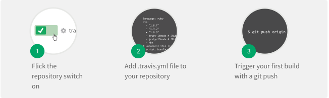

#	Travis CI

##	Quick Start

@see [Getting started](https://docs.travis-ci.com/user/getting-started)

Firstly, sign in with your GitHub account:


Then, itegreate travis-ci.org to your project in only THREE steps:



##	What Is In .travis.yml ?

```yml

```

##	SEE

*	Offcial Site  
	https://travis-ci.org
